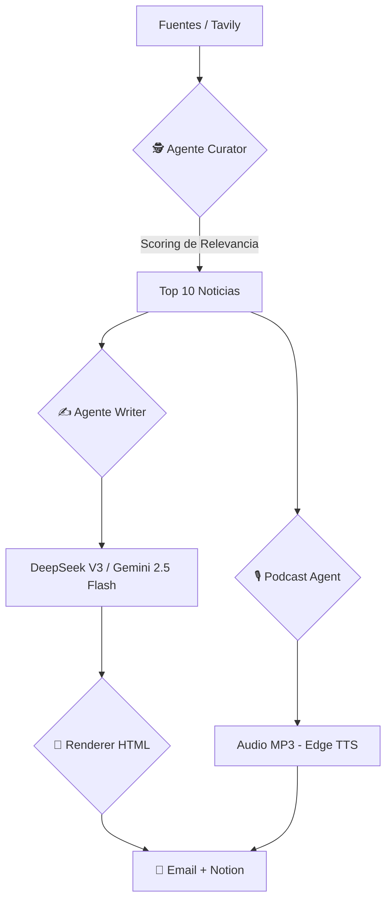

# Hallucination Check 🗞️

[](https://www.python.org/downloads/release/python-3120/) [-blue.svg)](https://openrouter.ai/) [](https://ai.google.dev/models/gemini) [](https://tavily.com/)

> "Tu dosis matutina de realidad para filtrar el hype de la IA antes del primer café."

**Hallucination Check** es un pipeline automatizado modular que curate, redacta y envía un newsletter diario de IA Generativa con audio MP3 — pensado para equipos bancarios y de estrategia que necesitan mantenerse al día sin perder horas buscando información.

**Costo operativo:** ~S/ 0.10 al día (VPS + créditos de IA en tiers gratuitos).

---

## 🏗️ Flujo del Pipeline


---

## 🤖 Agentes

| Agente | Archivo | Función |
|---|---|---|
| 🕵️ Curator | `agents/curator.py` | Busca con Tavily, filtra duplicados y asigna score de relevancia (0–10) |
| ✍️ Writer | `agents/writer.py` | Genera contenido editorial con tono directo y amigable |
| 🎨 Renderer | `agents/renderer.py` | Diseña el newsletter en HTML optimizado para lectura rápida |
| 🎙️ Podcast | `agents/podcast.py` | Crea un monólogo ejecutivo de ~10 min en español vía Edge TTS |

**Modelos:**
- **Primario:** `DeepSeek V3` vía OpenRouter
- **Fallback automático:** `Gemini 2.5 Flash` vía Google API

---

## 🚀 Instalación
```bash
git clone https://github.com/Pierillo/hallucination-check.git
cd hallucination-check

python3 -m venv venv_newsletter
source venv_newsletter/bin/activate
pip install -r requirements.txt

cp .env.example .env
nano .env  # Agrega tus credenciales
```

---

## ⚙️ Variables de entorno
```env
# APIs
TAVILY_API_KEY=your_tavily_key_here
GEMINI_API_KEY=your_gemini_key_here
OPENROUTER_API_KEY=your_openrouter_key_here

# Email (Gmail SMTP)
GMAIL_USER=your_email@gmail.com
GMAIL_PASSWORD=your_16_char_app_password

# Destinatarios (separados por coma)
EMAILS=email1@example.com,email2@example.com

# Notion Integration (opcional)
NOTION_TOKEN=your_notion_internal_token_here
NOTION_DATABASE_ID=your_database_id_here
```

---

## 💻 Uso

### Ejecución manual
```bash
python3 genai_newsletter/main.py
```

### Automatización en VPS (cron job)

Para recibirlo todos los días a las 8:00 AM:
```bash
0 8 * * * /ruta/al/venv_newsletter/bin/python3 /ruta/al/proyecto/genai_newsletter/main.py >> /ruta/al/proyecto/genai_newsletter/newsletter.log 2>&1
```

---

## 🆘 Troubleshooting

| Error | Causa | Solución |
|---|---|---|
| `429 Quota Exceeded` | Límite de OpenRouter o Gemini | El sistema activa el fallback automáticamente |
| `Gmail SMTP Error` | Contraseña incorrecta | Usa una App Password con verificación en 2 pasos activa |
| `Notion 401 Unauthorized` | Token inválido o BD no compartida | El flujo continúa igual — solo falla el registro en Notion |

---

## 🤝 Contribución

El diseño modular facilita extender el pipeline. Para agregar nuevos agentes o utilidades, usa las carpetas `agents/` y `utils/`.

---

## 📄 Licencia

MIT — úsalo, modifícalo y compártelo libremente.
